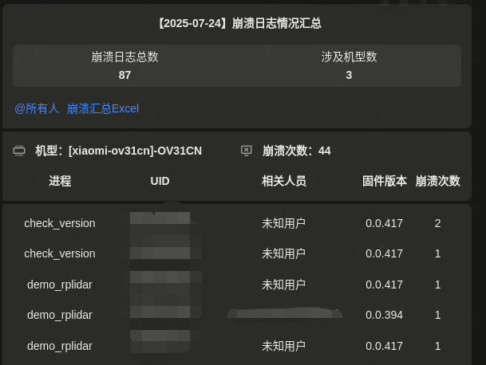

# CrashLogDashboard
A web application based on [vue3-element-admin](https://vue3-element-admin-site.midfar.com/), providing a data dashboard for [CrashLogPuller](https://github.com/DwanYunFey/CrashLogPuller), currently adopted by Xiaomi’s robot vacuum team for internal use to monitor any software crashes during runtime.

###### Note ⚠️: This project does not contain any confidential information from the previous company. As the project was entirely developed independently by an individual, it has been uploaded to GitHub for open-source purposes with the approval of the project team.
